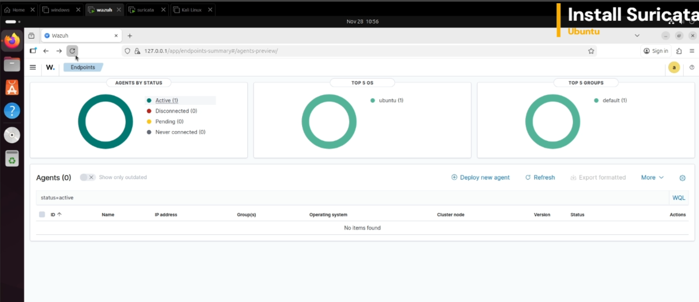
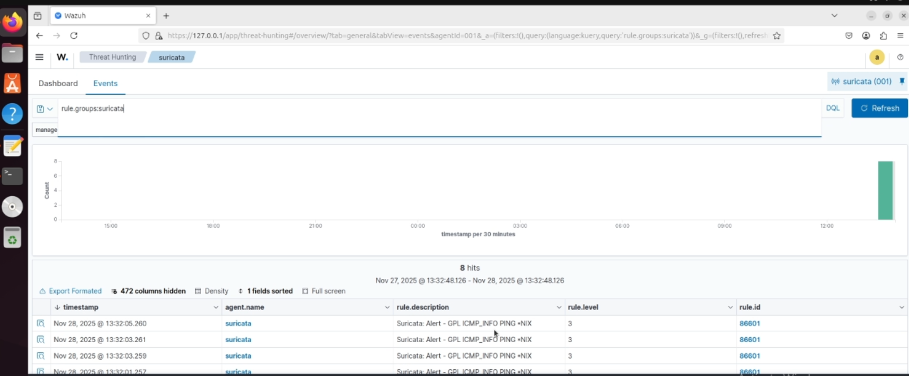

## Wazuh Lab [Suricata IDS integration]
## Suricata IDS integration

This document describes how to integrate Suricata (a Network-based Intrusion Detection System — NIDS) with Wazuh to monitor network traffic on an endpoint and forward alerts to Wazuh for central detection and correlation.

## What & Why

- Suricata inspects network traffic, applies IDS/IPS rulesets, and logs events (e.g. suspicious traffic, exploits, anomalies). :contentReference[oaicite:2]{index=2}  
- Wazuh can consume Suricata’s log output (eve.json) — parse, index, and generate alerts in its dashboard. :contentReference[oaicite:3]{index=3}  
- This integration gives you combined visibility: host-level logs (via Wazuh agent) + network-level detection (via Suricata) — useful for threat detection, SOC-style monitoring, and incident response.

## Prerequisites / Infrastructure

| Component | Description |
|-----------|-------------|
| Endpoint (e.g. Ubuntu 22.04) | This is where Suricata will be installed and run, capturing network traffic. :contentReference[oaicite:4]{index=4} |
| Wazuh Agent on that Endpoint | Configured to read Suricata’s log file (eve.json) so Wazuh can ingest the events. :contentReference[oaicite:5]{index=5} |

> **Note:** This guide was tested on Suricata v 6.0.8. :contentReference[oaicite:6]{index=6}
<br/>
---

## Integration Steps

1. **Install Suricata on the endpoint**  
```bash
sudo add-apt-repository ppa:oisf/suricata-stable
sudo apt-get update
sudo apt-get install suricata -y
```

2. **Download and extract the ruleset (e.g. Emerging Threats rules):**
```bash
cd /tmp/
curl -LO https://rules.emergingthreats.net/open/suricata-6.0.8/emerging.rules.tar.gz
sudo tar -xvzf emerging.rules.tar.gz
sudo mkdir /etc/suricata/rules
sudo mv rules/*.rules /etc/suricata/rules/
sudo chmod 777 /etc/suricata/rules/*.rules
```

3. **Configure Suricata — edit /etc/suricata/suricata.yaml and set at least:**
```yaml
HOME_NET: "<YOUR_ENDPOINT_IP_OR_SUBNET>"
EXTERNAL_NET: "any"

default-rule-path: /etc/suricata/rules
rule-files:
  - "*.rules"

stats:
  enabled: yes

af-packet:
  - interface: <YOUR_NETWORK_INTERFACE_NAME> ---> change any interface in that file to be you interface not just interface of af-packet
```


4. **Start/Restart Suricata:**
```bash
sudo systemctl restart suricata 
```

5. **Test Suricata:**
Test Suricata if there are errors in it 
```bash
suricata -T -c /etc/suricata/suricata.yaml
```

6. **Configure the Wazuh Agent to read Suricata logs — in /var/ossec/etc/ossec.conf, add:**
```xml
<ossec_config>
  <localfile>
    <log_format>json</log_format>
    <location>/var/log/suricata/eve.json</location>
  </localfile>
</ossec_config>
```


7. **Restart the Wazuh Agent to apply changes:**
```bash
sudo systemctl restart wazuh-agent
```

---
## Testing & Alert Generation
From The Attacker Device (Kali)
```bash
ping -c 20 "<ENDPOINT_IP>"
```

---
## See The Result In Wazuh Server
See The Result In Wazuh Server bu sercing with the following text
```pgsql
rule.groups:suricata
```
<br/>